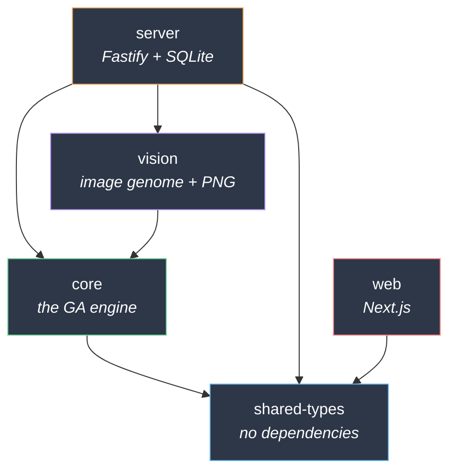
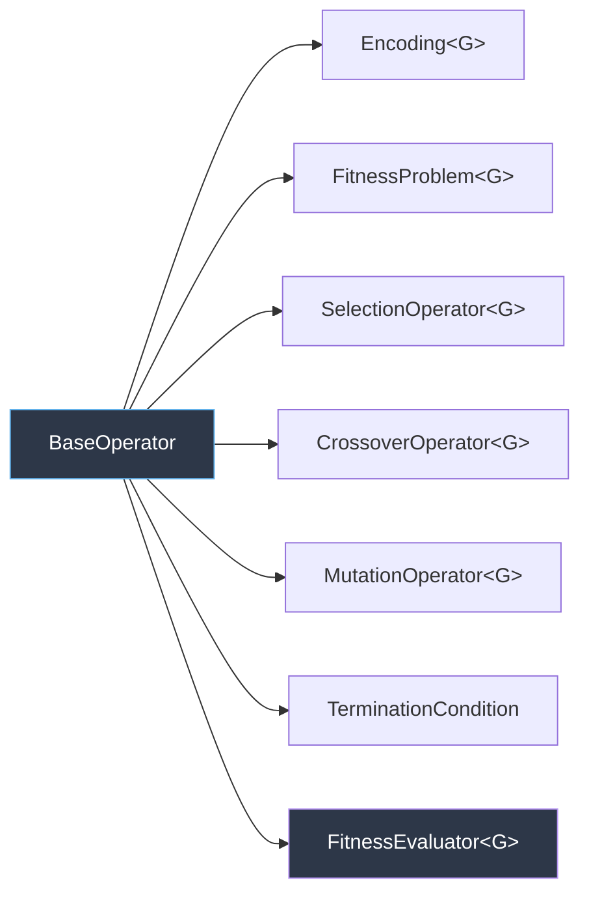
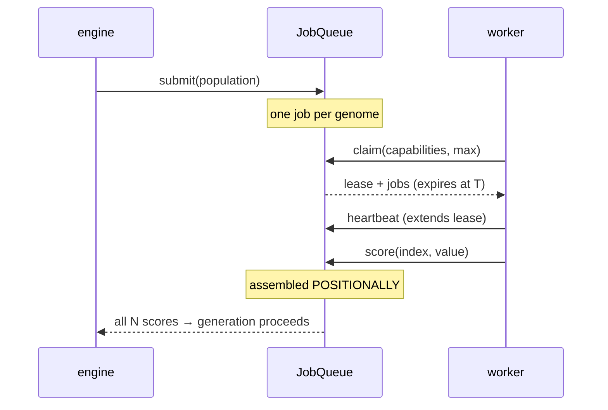
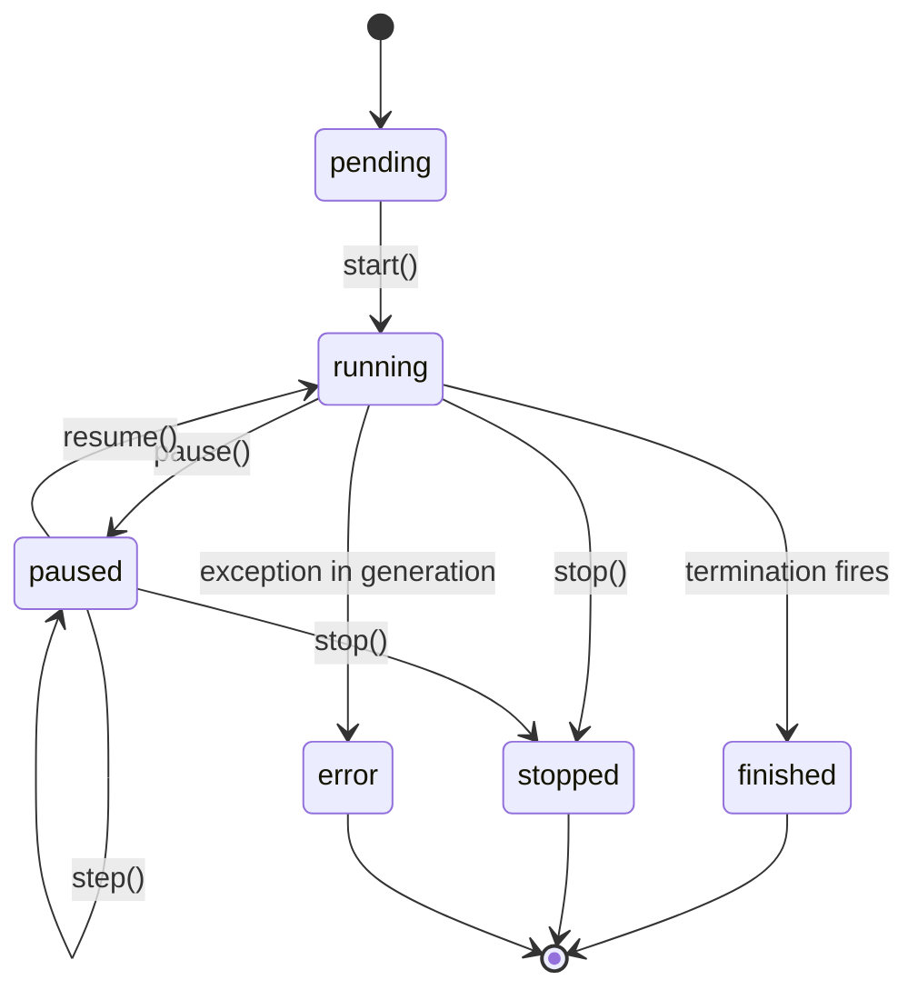
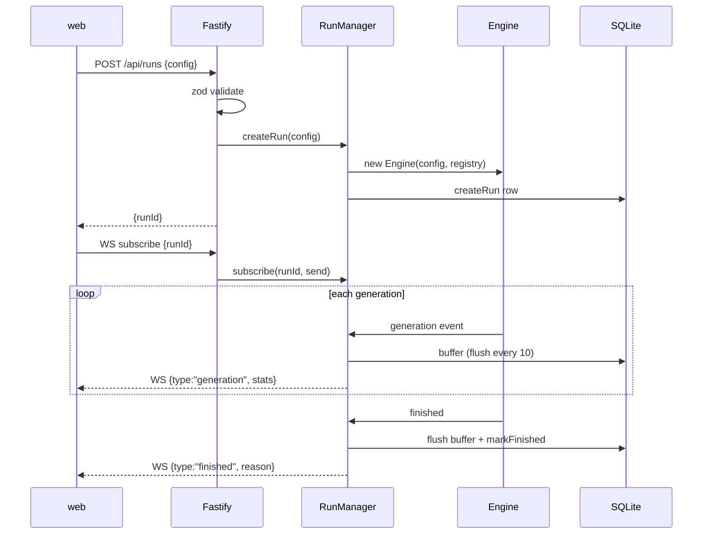

# genebaer Architecture

An extensible genetic algorithm runner with a live web visualizer.

This document has two halves. **[Repository Architecture](#part-1--repository-architecture)** covers how the monorepo is laid out, how it builds, and how work moves through it. **[Code Architecture](#part-2--code-architecture)** covers how the GA engine is actually structured — the abstraction every feature hangs off, how a run executes, and how state reaches the browser.

Every claim here was verified against source at the time of writing. Where the code has a sharp edge, this document says so rather than describing the intent.

---

## Part 1 — Repository Architecture

### The five packages

A pnpm workspace driven by turbo. Node >= 20, pnpm 11.9.0.

| Package | Role | Ships to browser? |
| --- | --- | --- |
| `packages/shared-types` | The type contract. Pure declarations, zero runtime code. | Types only |
| `packages/core` | The GA engine and every operator. | **No** |
| `packages/server` | Fastify HTTP + WebSocket host, SQLite persistence, job queue and worker registry. | No |
| `packages/vision` | Image genome, the image problem, and PNG encoding. | No |
| `apps/web` | Next.js visualizer. | Yes |

### Dependency direction



Two rules follow from this graph, and both are load-bearing:

**`web` does not depend on `core`.** It imports `@genebaer/shared-types` and nothing else from the workspace. The GA engine never enters the browser bundle — the browser only ever receives *data* about a run, never the machinery that produces it. Adding `@genebaer/core` to `apps/web/package.json` would silently pull the entire engine into the client bundle. Don't.

**`shared-types` depends on nothing.** It is the only package both halves of the system compile against, which is what makes it the wire contract. It deliberately contains no zod schemas — runtime validation lives in `server`, so the frontend bundle never carries duplicated validators. That choice is documented at the top of the file itself.

### Build pipeline

`turbo.json` defines five tasks:

| Task | Depends on | Notes |
| --- | --- | --- |
| `build` | `^build` | Outputs `dist/**`, `.next/**` |
| `test` | `^build` | Needs dependencies built first |
| `typecheck` | `^build` | Same |
| `lint` | — | No dependency; runs in parallel |
| `dev` | — | `cache: false`, `persistent: true` |

`^build` means "build all dependencies first," which is what forces the `shared-types → core → server` ordering. Turbo caches aggressively; a no-op run reports `FULL TURBO`.

### Quality gates

All four gates are real and cover all five packages. This matters more than usual here — see the loop protocol in `CLAUDE.md` — so the state of each is documented rather than assumed:

| Gate | Command | Coverage |
| --- | --- | --- |
| Typecheck | `pnpm typecheck` | 5 packages, `tsc --noEmit`, **including test files** |
| Test | `pnpm test` | 292 tests |
| Lint | `pnpm lint` | ESLint flat config, type-aware, `--max-warnings=0` |
| Build | `pnpm build` | `tsc -p tsconfig.build.json` + `next build` |

Turbo caches these. Note that `turbo.json` declares explicit `$TURBO_ROOT$`
inputs for the root-level configs — without them, editing `eslint.config.mjs` or
`tsconfig.base.json` does **not** invalidate the cache and a gate will replay a
stale green result. Add any new shared root config to the relevant task's inputs.

Testing runs in **two different modes**, which trips people up:

- `core`, `server`, `vision`, `web` — ordinary vitest. `web` runs under jsdom with Testing Library.
- `shared-types` — **type-level only** (`*.test-d.ts` via `vitest run --typecheck`). The package emits no runtime code, so a runtime test there would assert nothing. These tests guard the wire contract that would otherwise break silently.

`apps/web/vitest.config.ts` deliberately omits `@vitejs/plugin-react`; its Vite-internal imports don't match the Vite that vitest resolves. esbuild's `jsx: "automatic"` covers what the tests need.

### TypeScript configuration

Each package carries **two** configs, and the split is deliberate:

- `tsconfig.json` — **includes test files.** This is what `pnpm typecheck`, the
  IDE, and typescript-eslint's project service resolve, so tests are type-checked
  and type-aware lint rules apply to them.
- `tsconfig.build.json` (`core`, `server`, `vision`) — extends the above and excludes
  `src/**/*.test.ts`, so tests are never emitted into `dist`.

Getting this backwards is how test files end up unchecked: if `tsconfig.json`
excludes them, they vanish from `typecheck` *and* from the lint project service
at the same time, and nothing reports a gap.

`tsconfig.base.json` is strict in ways that shape the code you'll write:

- `exactOptionalPropertyTypes` — `foo?: string` and `foo: string | undefined` are different types
- `noUncheckedIndexedAccess` — `arr[i]` is `T | undefined`, which is why the engine is full of `as G` and `!` assertions after bounds-checked loops
- `verbatimModuleSyntax` — type-only imports must say `import type`
- `module: NodeNext` — **relative imports need the `.js` extension**, even in `.ts` source

### Issue tracking

Work is tracked in **beads** (`bd`), not markdown TODOs. Issues live in a local Dolt DB; `.beads/issues.jsonl` is a passive export that *is* committed — and this repo is public, so issue bodies are world-readable.

The repo opts into the **team-maintainer** agent profile: agents run the full implement→validate→publish cycle autonomously, one bead per branch (`bead/<id>`), and open a PR. Humans merge. The full protocol, including the `bd export` race that will bite you if you skip it, is in `CLAUDE.md` and `AGENTS.md`.

---

## Part 2 — Code Architecture

### The one abstraction that matters

Everything extensible in genebaer is a `BaseOperator` subclass registered in an `OperatorRegistry` under a `(kind, id)` pair.

```typescript
abstract class BaseOperator {
  static readonly operatorId: string;      // registry id, e.g. "tournament"
  static readonly displayName: string;     // shown in the UI
  static readonly description: string;     // shown in the UI
  static readonly paramsSchema: Record<string, JSONSchema>;  // drives the form

  readonly params: Record<string, unknown>;
  constructor(params: Record<string, unknown> = {}) { ... }
}
```

The static metadata is the whole trick. `paramsSchema` is served to the browser via `GET /api/operators`, and `apps/web` **auto-generates the configuration form from it** (`components/param-fields.tsx`). Declaring a param schema on a new operator is sufficient to make it configurable in the UI — there is no second place to register a form field.

### The seven operator kinds



| Kind | Contract | Built-ins |
| --- | --- | --- |
| `encoding` | `random`, `distance`, `size`, `clone`, `equals` | binary, numeric, string |
| `problem` | `evaluate(genome) → number`, optional `visualize` | one-max, sphere, rastrigin, weasel, mds |
| `selection` | `select(pop, fitnesses, count, rng) → G[]` | tournament, roulette, rank, elitism |
| `crossover` | `crossover(a, b, rng) → [G, G]` | one-point, two-point, uniform, arithmetic |
| `mutation` | `mutate(genome, rate, rng) → G` | bitflip, gaussian, swap, char |
| `termination` | `check(history) → string \| null` | max-generations, target-fitness, stagnation |
| `evaluator` | `evaluateBatch(genomes, ctx) → Promise<number[]>` | local |

**Fitness is always maximized.** Higher is better, everywhere. A minimization problem must negate inside `evaluate`.

**`problem` is *what* is optimized; `evaluator` is *how and where* it is scored.**
The problem defines fitness; the evaluator decides whether the population is
scored in-process, on worker threads, or by remote workers. The engine calls
the evaluator **once per generation with the whole population** and awaits it —
never once per genome, since a round trip per individual is what makes a remote
evaluator unusable. `RunConfig.evaluator` is optional and defaults to `local`,
which calls the problem directly and is what every run did before evaluators
existed.

Scores are assigned **positionally**, so an evaluator must return exactly one
score per genome in input order. The engine rejects a length mismatch rather
than pairing genomes with the wrong scores silently.

### Distributed evaluation

`local` scores in-process. Everything else goes through a **job queue** served
by workers, and this is the part worth understanding before changing anything
in `packages/server/src/eval/`.

**Contract vs. capability.** A `RunConfig` names a scoring *contract* —
`clip-similarity@clip-vit-base-patch32.1` — and the worker registry decides
which connected workers satisfy it. Nothing in a run ever names a machine. That
is what makes a worker thread and a browser tab interchangeable rather than two
different architectures, and it is why "should this run on the server or in the
browser?" is a deployment question here, not a design one.

**Version is part of the match.** Scores from two model versions are not
comparable, so a v1 worker is never handed a v2 job, and the score cache keys on
the version too. Getting this wrong would distort a run's fitness landscape
mid-flight with no error anywhere.

#### The job lifecycle



**Leases are mandatory, not a refinement.** The engine is generational, so it
waits for *every* score. A worker that claims jobs and vanishes — a closed tab,
a killed thread, a shut laptop — would otherwise hold the barrier open forever.
On expiry, only the *unscored* jobs are re-dispatched.

A late score from an expired lease **is** accepted when nobody else scored that
job, because the work is perfectly good and discarding it wastes an inference —
but it never overwrites a score another worker already recorded.

#### The straggler consequence

The generational barrier means a generation finishes at the pace of the
**slowest claim**. That is the price of keeping selection consistent, and it is
why `GET /api/eval/stats` names blockers explicitly: which evaluation, how many
jobs remain, which workers hold them, and whether anything can serve the
contract at all. Every failure mode here looks identical from outside — the run
simply stops advancing — so that endpoint is the difference between diagnosing
and guessing.

#### Workers

| Kind | Transport | Notes |
| --- | --- | --- |
| Worker thread | in-process | `WorkerPool`; scoring never runs on the main thread, which would starve the engine's `setImmediate` loop |
| Browser tab | `/ws/worker` | Same protocol; closing a tab returns its jobs immediately |
| Anything else | `POST /api/workers/*` | Same protocol over HTTP |

The thread entry point and its scorers are plain `.mjs`, because a
`worker_thread` needs a real file at runtime. `tsc` does not copy files it does
not compile, so the server build has an explicit copy step — without it the pool
works in dev and tests and fails only in a built server.

#### Captions are not fitness

A separate `CaptionQueue` and a separate `annotation` WS message, deliberately.
A caption is text for a human — "is this run going anywhere?" — and keeping it
off the scoring path makes that structural rather than a convention. It runs on
the best genome only, every N generations, and is entirely best-effort: stale
requests are dropped, never re-dispatched, and a run completes normally with
captioning dead.

**`Encoding<G>` is the type anchor.** It defines what a genome *is* for a run; every other operator is generic over the same `G`. Compatibility is advertised via a static `compatibleEncodings` array, which the registry surfaces as metadata and the UI uses to filter incompatible choices out of the form.

**`TerminationCondition` returns a reason string, not a boolean.** Returning `null` continues; returning a string stops the run and that string becomes the user-visible reason. Any single condition firing ends the run.

### Registry

`OperatorRegistry` maps `(kind, id) → constructor`.

- `register()` **throws on duplicate ids** within a kind — collisions fail loudly at startup, not silently at resolve time
- `resolve()` throws `Unknown ${kind} operator id '${id}'` for anything unregistered
- `listMetadata()` produces the `OperatorMeta[]` the UI consumes
- `clone()` returns an extensible copy — the way to add operators without mutating the default set

`createDefaultRegistry()` in `defaults.ts` is the single place every built-in is wired up. A new operator that isn't registered there does not exist as far as the running system is concerned.

### RunConfig is declarative

```typescript
interface RunConfig {
  problem: OperatorRef;      // { id, params? }
  encoding: OperatorRef;
  selection: OperatorRef;
  crossover: OperatorRef;
  mutation: OperatorRef;
  termination: OperatorRef[];   // ANY firing stops the run
  mutationRate: number;
  populationSize: number;
  elitism: number;
  seed: number;
}
```

Everything is a registry id plus a params object, so a config is JSON-serializable end to end — storable in SQLite, postable over HTTP, saved to localStorage as a preset. The engine resolves ids through the registry in its constructor.

### Run lifecycle



`start()` on a `finished` or `stopped` run **throws** — runs are not restartable. `step()` executes exactly one generation while paused or pending and leaves status `paused`.

The loop is driven by `setImmediate`, one generation per tick. That is what keeps the server responsive: the engine yields to the event loop between generations rather than blocking on a tight `for`.

### One generation, in order

1. **Evaluate** — `problem.evaluate()` across the population
2. **Compute stats** — best / mean / median / worst / stdDev, plus `diversity`
3. **Emit** `generation` and `best`
4. **Check termination** — against history **including** the generation just computed
5. **Elitism** — clone the top `elitism` genomes verbatim into the next population
6. **Select** parents for the remaining slots
7. **Crossover + mutate** each parent pair into children
8. Increment generation

Two details that surprise people:

**Termination sees the current generation.** `check(history)` is called after the new stats are pushed, so `MaxGenerations(1)` stops after one generation, not two.

**Diversity is sampled, and the sample ADAPTS to genome size.** `computeDiversity()` shuffles the population and compares pairs, but the sample shrinks as genomes grow so total element comparisons stay under a fixed budget. At 50 individuals and a 98,304-bit image genome the exact metric would be ~120 million comparisons every generation — dominating a loop it only exists to describe. It is an estimate, a real one, and `diversitySampleSize()` is exported so the policy can be asserted directly rather than inferred from a stopwatch.

Parent count is rounded up to even (`needed % 2 === 0 ? needed : needed + 1`) because crossover produces children in pairs; the extra child is discarded when `needed` is odd.

### Determinism

`SeededRandomSource` is mulberry32 — seeded, fast, and bit-for-bit reproducible across platforms. Same seed + same config ⇒ identical run, **provided the evaluator is deterministic**.

That proviso is not decoration. It holds unconditionally for `local` and for any evaluator that is pure arithmetic. It does **not** hold for a model-backed evaluator: GPU float non-determinism, batching effects and model-version drift all mean two runs of the same config can produce different numbers.

What restores it is the **score cache**. Keyed on genome + evaluator identity + params, a replay of a completed run hits cache for every genome and reproduces its fitness values exactly, with zero inference. So:

| Situation | Reproducible? |
| --- | --- |
| `local` evaluator, same seed | Yes, unconditionally |
| Model-backed, first run | No |
| Model-backed, replay with a warm cache | Yes, exactly |

Being precise about which of these you are in matters when comparing two runs: a difference you attribute to a config change may just be the model.

This all holds only as long as every operator draws randomness exclusively from the injected `RandomSource`. An operator calling `Math.random()` directly breaks reproducibility for the whole system, and no test will catch it. This is the single easiest way to do real damage here.

(An operator that draws *no* randomness is fine and not a bug — `ArithmeticCrossover` blends on a configured alpha and is deterministic by design, which is why its `rng` parameter is named `_rng`.)

### Server



`RunManager` owns every live run and wires each engine to two sinks: WebSocket broadcast and SQLite persistence.

**Stats are buffered.** `FLUSH_EVERY = 10` — generation stats accumulate in memory and write to SQLite in batches, with a final flush on `finished`. WebSocket delivery is *not* buffered; clients see every generation immediately.

`RunStore` applies two deliberate SQLite pragmas: `journal_mode = MEMORY` (no `-wal`/`-shm` files on disk) and `locking_mode = EXCLUSIVE` (single writer, no lock contention).

### REST surface

| Endpoint | Purpose |
| --- | --- |
| `GET /api/operators` | All operator metadata — drives the UI forms |
| `GET /api/problems` | Problem metadata only |
| `POST /api/runs` | Validate config, create **and start** a run |
| `GET /api/runs` | List summaries |
| `GET /api/runs/:id` | Detail + full stats history |
| `POST /api/runs/:id/control` | `pause` / `resume` / `step` / `stop` |
| `GET /api/runs/:id/visual` | Current-best visual frame |
| `DELETE /api/runs/:id` | Stop if running, then delete |

`POST /api/runs` creates *and starts* in one call — there is no separate start endpoint.

Status codes carry meaning: **400** = malformed body (zod), **422** = valid shape but the engine rejected it (unknown operator id, `elitism >= populationSize`), **404** = no such run, **409** = illegal transition for the run's current state.

### WebSocket protocol

Single endpoint `/ws`. Clients send `{type: "subscribe" | "unsubscribe", runId}`; the server sends four message types, all discriminated on `type` and all tagged with `runId`:

| Message | Payload |
| --- | --- |
| `generation` | `stats: GenerationStats` |
| `best` | `generation`, `genome`, `fitness` |
| `status` | `status: RunStatus` |
| `finished` | `reason`, `finalBestFitness`, `generations` |

Subscriptions are tracked per socket in a `Map` keyed by `runId`, so one socket
may watch several runs independently: `unsubscribe` tears down only the named
run, and re-subscribing to a run already being watched *replaces* its handler
rather than stacking a second one. Both behaviors are covered by regression
tests in `server.test.ts`.

### Web data flow

Next.js App Router, five routes: `/`, `/experiments/new`, `/runs`, `/runs/[id]`, `/compare`.

- `lib/config.ts` — `API_URL` from `NEXT_PUBLIC_API_URL` (default `http://localhost:4040`); `WS_URL` is derived from it by rewriting `http→ws` / `https→wss` and appending `/ws`. Set the HTTP URL only; the WS URL follows.
- `lib/api.ts` — thin typed fetch wrapper, throws `ApiError` carrying the status code
- `lib/use-run-stream.ts` — the live subscription hook
- `lib/presets.ts` — configs saved to `localStorage`, degrading to empty on corrupt JSON

`useRunStream` reconnects with exponential backoff (up to 5 attempts, capped at 10s), stops reconnecting once the run has finished, and **de-duplicates generations after a reconnect** by dropping any stats whose generation is `<=` the last one seen.

---

## Adding a new operator

Concretely, for a new selection operator:

1. **Create the class** in `packages/core/src/operators/selection/`, extending `SelectionOperator<G>`:

```typescript
export class MySelection extends SelectionOperator<unknown> {
  static override readonly operatorId = "my-selection";
  static override readonly displayName = "My selection";
  static override readonly description = "One line — this is shown in the UI.";
  static override readonly paramsSchema = {
    pressure: { type: "number", minimum: 0, maximum: 1, default: 0.5, title: "Pressure" },
  } as const;
  static readonly compatibleEncodings = ["binary", "numeric"] as const;

  override select(pop: readonly unknown[], fit: readonly number[], count: number, rng: RandomSource): unknown[] {
    // draw ONLY from rng — never Math.random()
  }
}
```

2. **Register it** in `defaults.ts` inside `createDefaultRegistry()`. Skipping this means it doesn't exist.
3. **Export it** from `packages/core/src/index.ts` if consumers should reach it directly.
4. **Test it** in `packages/core/src/engine.test.ts` or a sibling suite.
5. **Do nothing in the UI.** The form generates itself from `paramsSchema`.

Omit `compatibleEncodings` (or leave it empty) to mean encoding-agnostic.

## Adding an evaluator

An evaluator answers *how and where* fitness is computed, not what it means.

**In-process** — extend `FitnessEvaluator` and implement `evaluateBatch`. Suitable
only for cheap, synchronous scoring; anything CPU-bound belongs on a thread.

**Distributed** — extend `QueuedEvaluator` in `packages/server`. Supply identity
and nothing else:

```typescript
export class MyScorer extends QueuedEvaluator {
  static override readonly operatorId = "my-scorer";   // the CONTRACT
  static override readonly version = "model-v3";       // bump on ANY change
  static override readonly displayName = "My scorer";
  static override readonly description = "One line, shown in the UI.";
  static override readonly paramsSchema = {} as const;

  // Optional: do work once on the server that every worker would repeat.
  protected override prepare(genome: unknown): unknown { ... }

  // Optional: scoring input that lives on the PROBLEM, not the evaluator.
  // The score cache keys on whatever this returns.
  protected override paramsForJob(ctx): Record<string, unknown> { ... }
}
```

Three rules worth internalising:

1. **Bump `version` whenever the meaning of the score changes** — a different
   model, different preprocessing, different normalisation. Scores across
   versions are not comparable, and the cache and the registry both key on it.
2. **`paramsForJob` and the cache key must agree.** They do by construction
   today; if you override one, you are changing the other.
3. **Never invent a score on failure.** A stand-in metric looks like it is
   working while steering a whole run at something unrelated, and no gate
   catches it. Throw.

## Adding a worker

A worker is anything that can register a capability and answer with numbers.

1. **Register** capabilities as `{ evaluatorId, version }` pairs — over HTTP
   (`POST /api/workers/register`) or WS (`/ws/worker`).
2. **Claim** work; you receive a lease with an expiry and a batch of jobs.
3. **Score** each job by index. Positional: the index is how the engine
   reassembles the generation.
4. **Heartbeat** on long batches. A `false`/`leaseLost` answer means your jobs
   were re-dispatched — stop and claim again rather than finishing work someone
   else now owns.
5. **Fail loudly** if you cannot score at all, rather than going quiet, which
   only costs the run a lease timeout.

Thread-side scorers live in `packages/server/src/eval/scorers.mjs`, keyed by
contract id. They are plain `.mjs` because a `worker_thread` loads a real file
at runtime — add new ones there and the build copy step carries them across.

The same shape applies to the other five kinds — different base class, different registry kind, same five steps.

---

## Known sharp edges

Verified, current, and worth knowing before you debug them:

1. **Runs live in memory and do not resume.** `RunManager` holds engines in a `Map`, and the population is never persisted — only stats and the best genome — so a run cannot be continued once its process ends. On boot, `RunManager` **reconciles**: any row still reading `pending`/`running`/`paused` is closed out as `stopped` with a `stopReason` naming the restart. The run is still lost; what changed is that the UI is never told a run is live when nothing is driving it. Closing the server also pauses live engines before the database closes, so shutdown does not leave engines writing to a closed handle.
2. **Runs are not restartable.** `start()` on a `finished` or `stopped` run throws.
3. **`mutationRate` semantics are operator-defined.** Per-gene for `BitFlipMutation`, but each operator interprets the rate itself. Read the operator before assuming.
4. **`data/` is gitignored.** The SQLite DB is local-only; there is no shared run history.
5. **`elitism` is validated in two places with different strictness.** zod accepts any non-negative integer; the engine additionally requires `elitism < populationSize` and throws `RangeError`, surfacing as a 422.
6. **A queued evaluator needs a running server.** It resolves its queue from module scope, because the registry constructs operators with params only and cannot inject services. Using one outside a server rejects with a clear message rather than hanging.
7. **A WS lease frame is large.** A population of 40 at 64x64 RGB encodes to ~1.97 MB of JSON, not the ~491 KB the raw pixel count suggests - JSON writes each byte as decimal text. `maxPayload` is 8 MB for this reason; at 128x128 a batch of 40 uses ~7.87 MB, so bigger runs must claim smaller batches.
8. **Real model inference is not covered by the test suite.** CLIP scoring uses a swappable backend and the tests inject a fake, so the contract, caching and failure paths are covered but "the model produces a useful gradient" is not. Measured separately - see `docs/experiments/`.
